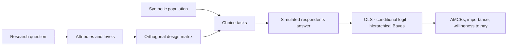

# How it works

Traditional causal market research is slow and expensive because recruiting
humans is slow and expensive. Subconscious.ai replaces the recruited panel with
simulated respondents, and keeps the experimental design and statistics
unchanged.

## The four parts

**Synthetic respondents.** AI-generated respondent profiles, built to be
demographically representative rather than convenient. Because the population
is constructed rather than recruited, it does not suffer from self-selection
bias or oversampling of whoever answers surveys.

**Causal experimental design.** Every study is a randomised discrete choice
experiment. Randomisation is what licenses causal claims: attributes vary
independently of one another, so an effect can be attributed to the attribute
rather than to what it correlates with.

Correlational work can rule things in. Only a randomised design rules things
out.

<small>xkcd 925, Randall Munroe, CC BY-NC 2.5.</small>

**Interactive design.** You supply a question; the platform proposes
attributes, levels, and respondent instructions, and you correct them before
running.

**Automation.** Design, execution, and analysis run without a human in the
loop, which is where the cost and time reduction comes from.

## What is genuinely different

The claim is not that a language model can guess what people want. It is that a
well-specified experiment run against a representative simulated population
reproduces the effects measured in human studies: a claim that is testable,
and tested. See [Human baselines](/concepts/human-baselines).

## What it is not

- Not a survey tool. There is no recruiting, no fielding, no incentives.
- Not a forecast. It measures relative preference within the design you gave it.
- Not a replacement for talking to customers. It answers "which of these
  moves the decision", not "what should we build".
