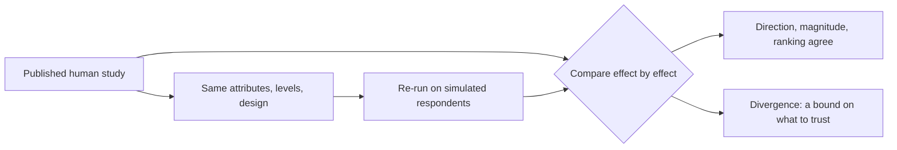

# Human baselines

Simulated respondents are only worth anything if they reproduce what humans do.
Human baselines are how that gets checked, rather than asserted.

## The method

Take a published human conjoint study. Re-run it on the platform with the same
attributes, levels, and design. Compare the estimated effects against the
original human results.

If the simulated AMCEs track the human AMCEs: same direction, comparable
magnitude, same ranking of what matters: the platform reproduces that study.
Where they diverge, that is a finding too, and a bound on what the platform
should be trusted for.

## Review the evidence

Use the [methodology](/concepts/methodology) and
[research design guide](/guides/research-design) to plan a matched comparison.
For a study-specific replication record, contact
[support@subconscious.ai](mailto:support@subconscious.ai) with the study,
population, design and result you want to evaluate.

A useful record identifies the original study, the matched experimental design,
the estimator, the reported comparisons and where the simulation diverged.

## How to use this

When you present a result to someone who has not seen the platform before, the
question is always "why should I believe this?" The honest answer is the
replication record: here are published human studies, here is what the platform
produced for them, here is how closely they agree.

That record is also the right place to check before running in a new domain.
Replication in one area is evidence, not a guarantee, for another.
